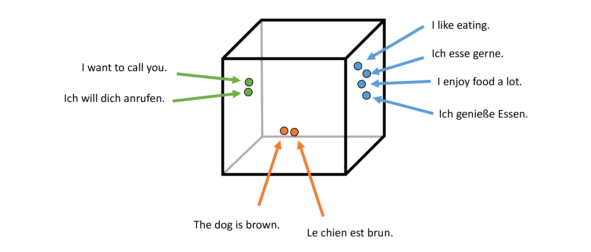
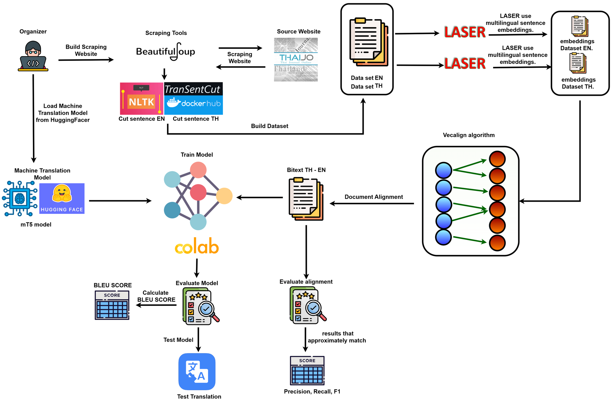
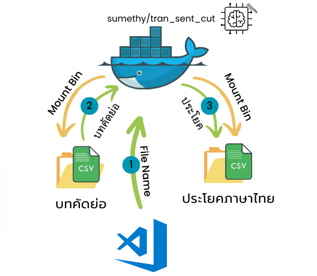

# อัลกอริทึมจับคู่ประโยคภาษาไทย-อังกฤษ สำหรับพัฒนาระบบแปลภาษาด้วยโครงข่ายประสาทเทียม
# Thai-English parallel sentence alignment algorithm for neural machine translation system development

Thai-English parallel sentence alignment algorithm for neural machine translation system development เป็นการศึกษาเกี่ยวกับการนำอัลกอริทึมการจับคู่ประโยคระหว่าง ภาษาอังกฤษ-ไทย เพื่อช่วยให้นักพัฒนาที่ต้องการพัฒนา Machine Tranlation สามารถที่จะจัดเตรียมชุดข้อมูลที่มีคุณภาพได้อย่างรวดเร็ว โดยทางคณะผู้จัดทำได้เลือกใช้ อัลกอริทึมการจะคู่ประโยคระหว่างสองภาษาที่มีการจับคู่ประโยคที่มีความถูกต้องและรวดเร็ว ชื่อว่า [Vecalign](https://github.com/thompsonb/vecalign/) ซึ่งใช้ความคล้ายคลึงกันของประโยคจากการ Embeding ด้วย Multilingual_Sentence_Embedding และการเขียนโปรแกรมการจับคู่ประโยคแบบ Dynamic โดยในโครงงานนี้คณะผู้จัดทำได้เลือกใช้ Multilingual_Sentence_Embedding ตามที่ผู้พัฒนาอัลกอริทึม Vecalign เลือกใช้ คือ [Language-Agnostic SEntence Representations (LASER)](https://github.com/facebookresearch/LASER)

#### เมื่อ Embeding ประโยคในประโยคต่างภาษาที่มีความหมายเหมือนกัน ข้อมูล Vector จะใกล้เคียงกัน

[รูปจาก [Facebook AI post](https://engineering.fb.com/ai-research/laser-multilingual-sentence-embeddings/)]

#### การทำงานของ Vecalign โดยใช้การเขียนโปรแกรมแบบ Dynamic

[รูปจาก [Vecalign GitHub](https://github.com/thompsonb/vecalign/?tab=readme-ov-file)]

ในการนำมาประยุกต์ใช้งานกับภาษาไทยนั้น สิ่งที่ท้าทายที่สุดสำหรับการจับคู่ประโยค ภาาษาไทย-อังกฤษ คือ การตัดประโยค เนื่องมาจากประโยคในภาษาไทยนั้นไม่มีจุดสัญลักษณ์แสดงจุดสิ้นสุดประโยคที่ชัดเจน แต่จะใช้การเว้นวรรคแทน ซึ่งการเว้นวรรคนั้นยังคงถูกใช้ในบริบทอื่นๆ ด้วย ซึ่งวิธีในการตัดประโยคภาษาไทยที่สามารถตัดประโยคภาษาไทยได้ดีที่สุด และเปิดเผยต่อสาธารณะ ที่คณะผู้จัดทำเลือกใช้ คือ [Transentcut](https://github.com/sumethy/TranSentCut/)

#### เมื่อนำเครื่องมือทั้งหมดมารวมกันจึงสามารถนำมาเขียนเป็นแนวคิดในการจัดทำโครงงานได้ ดังนี้

ในการจัดทำโครงงานมีขั้นตอน ดังนี้
  1. ดึงข้อมูลบทคัดย่อจากเว็บไซต์ [Thai Journal Online (ThaiJO)](https://www.tci-thaijo.org)
  2. ตัดบทคัดย่อภาษาอังกฤษด้วย [Natural Language Toolkit (NLTK)](https://www.nltk.org/) และตัดบทคัดย่อภาษาไทยด้วย Transentcut
  3. การตัดประโยคภาษาไทยด้วย Transentcut
  4. Embeding ประโยคภาษาอังกฤษ และภาษาไทยด้วย LASER version2
  5. จับคู่ประโยคภาษาอังกฤษ-ไทย ด้วย Vecalign
  6. วัดประสิทธิภาพการจับคู่ประโยคด้วยการหาค่า Precision, Recall, และ F1-Score ในการจับคู่ประโยค
  7. พัฒนาแบบจำลอง [A massively multilingual pre-trained text-to-text transformer (mT5)](https://huggingface.co/docs/transformers/model_doc/mt5) และวัดประสิทธิภาพด้วยการหาค่า Bleu Score

### ขั้นตอนการทำโครงงาน
#### 1. ดึงบทคัดย่อจากเว็บไซต์ ThaiJO
  ในการดึงบทคัดย่อมาจากเว็ยไซต์ ThaiJO จะดึงบทคัดย่อจากวารสาร วิศวกรรมศาสตร์ ที่ใช้ฟอร์มเว็บไซต์ของ ThaiJO ที่ผ่านการรับรอง Tier 1, Tier 2, และ Tier 3 โดยโปรแกรมของผู้จัดทำจะเข้าไปดึงข้อมูลจากหน้าเว็บไซต์ทั้งหมด 4 หน้าเว็บไซต์ เพื่อรวบรวมลิงค์ สำหรับดึงบทคัดย่อ ซึ่งมีลำดับดังนี้ 1) หน้าเว็บไซต์วารสารย้อนหลัง --> 2) หน้าเว็บไซต์วารสารย้อนหลังแต่ละฉบับ --> 3) หน้าเว็บไซต์ของบทคัดย่อภาษาแรก --> 4) หน้าเว็บไซต์ของบทคัดย่อภาษาที่สอง
  โดยสามารถรันโปรแกรมให้ทำงานดังนี้
  - ให้รวบรวมลิงค์ของวารสารที่ต้องการดึงลิงค์ ดยสามารถคัดเลือกจากการ Export ไฟล์ Excel จากฐานข้อมูล TCI ได้ และนำมาคัดเลือกเฉพาะลิงค์ที่เข้าเงื่อนไขที่ต้องการและจัดรูปแบบให้เข้ากับรูปแบบที่เรากำหนด ซึ่งประกอบด้วย Column 'Tier' และ Link ของ 'Journal' ดังตัวอย่างในไฟล์ journal/journal.csv
  - ให้รันโปรแกรม `pull_article_link.py` เพื่อดึงลิงค์ของวารสารโดยที่จะต้องกำหนดพารามิเตอร์ล่วงหน้า คือ 1) Path ของ Folder ที่เก็บลิงค์ 2) Path ของ Folder ที่จะเก็บบทคัดย่อ 3) ปีเริ่มต้นที่จะดึงข้อมูล 4) ปีสุดท้ายที่จะดึงข้อมูล

เมื่อดึงข้อมูลแล้วโปรแกรมจะเก็บข้อมูลเป็นไฟล์ตามบทคัดย่อเก็บไฟล์ใน Folder ที่ระบุ โดยจะจัดเก็บชื่อเป็นตัวเลข

#### 2. การตัดประโยคบทคัดย่อภาษาอังกฤษ
ในการตัดประโยคบทคัดย่อภาษาอังกฤษจะใช้การตัดประโยคด้วย NLTK โดยตัดตามสัญลักษณ์สิ้นสุดประโยค
ซึ่งสามารถตัประโยคด้วยโปรแกรม `Cut_en.py` โดยพารามิเตอร์ที่กำหนดคือ 1) Path ของ Folder ที่เก็บไฟล์ count.csv 2) Path ของ Folder ที่จัดเก็บบทคัดย่อ 3) Path ของ Folder ที่จัดเก็บไฟล์เมื่อตัดบทคัดย่อเสร็จสิ้น ซึ่งเมื่อตัดประโยคเสร็จสิ้นจะจัดเก็บไว้เป็นลำดับตัวเลข

#### 3. การตัดประโยคบทคัดย่อภาษาไทย
ในการตัดประโยคบทคัดย่อภาษาอังกฤษจะใช้การตัดประโยคด้วย Transentcut โดยติดตั้งบน (Docker)[https://www.docker.com/] และใช้การดึงบทคัดย่อที่ต้องการตัด จากโฟลเดอร์ที่ Mount bin ไว้ และจะจัดเก็บข้อมูลหลังจากตัดประโยคเสร็จสิ้นด้วยการจัดเก็บไว้ในโฟลเดอร์ที่ Mount bin ไว้เช่นกัน



ขั้นตอนการเตรียมเครื่องมือสำหรับการตัดประโยคภาษาไทย
- ติดตั้ง Docker
- ดึง Image ชื่อว่า [sumethy/tran_sent_cut](https://hub.docker.com/r/sumethy/tran_sent_cut) (สามารถดึงโดยรันผ่าน CMD บน Window) ด้วยคำสั่ง
```
docker pull sumethy/tran_sent_cut:0.3gpu
```
- สร้าง Containner บน Docker
```
docker run -d --name some-name -v C:/Users/Sentence_Alignment/Prepare_data_set/thai_sentences:/app/thai_sentences -v C:/Users/Sentence_Alignment/Prepare_data_set/data:/app/data -e MAX_WORKERS="1" -e GPU_ENV="GPU" --gpus '"device=0"' sumethy/tran_sent_cut:0.3gpu
```
- นำไฟล์ที่เราได้แก้ไขขั้นการอ่านไฟล์และบันทึกไฟล์ โดยใช้คำสั่ง
```
cp /app/data/main.py /app/main.py
```
- ติดตั้ง Module ที่ใช้ในการบันทึกไฟล์ เนืjองจาก Image ของ Transentcut ไม่ได้ติดตั้งไว้
```
pip install pandas
```
- รันโปรแกรม `Cut_th.py` โดยมีพารามิเตอร์ต้องกำหนดคือ 1) Path ของ Folder ที่เก็บไฟล์ count.csv 2) Path ของ Folder ที่จัดเก็บบทคัดย่อ 3) Path ของ Folder ที่จัดเก็บบทคัดย่อบน Docker 4) Path ของ Folder ที่จะจัดเก็บประโยคที่ตัดบน Docker 5) ชื่อของ Containner บน Docker 6) โหมดในการตัดบทคัดย่อโดยมีสองโหมดคือ ตัดทั้งหมดใหม่ และตัดเฉพาะบทคัดย่อที่ยังไม่ได้ตัด


### 4. จัดเตรียมเอกสารประโยคภาษาไทยเเละ ภาษาอังกฤษที่ผ่านการตัด
- โปรเเกรมของเราจะตัดประโยคเเยกทีละไฟล์บทคัดย่อทั้งภาษาไทยเเละ อังกฤษในส่วนนี้ทางเราจึงเขียนโปรเเกรมที่ชื่อว่า Combiend_file.py เพื่อทำการรวมไฟล์ csv ของเเต่ละภาษาที่ได้ทำการเเยกไฟล์ตัดประโยคเเต่ละบทคัดย่อไว้ ซึ่งภายในโฟลเดอร์ english_sentences จะมีไฟล์การตัดประโยคของเเต่ละบทคัดย่อภาษาอังกฤษ เเละ english_sentences  จะมีไฟล์การตัดประโยคของเเต่ละบทคัดย่อภาษาไทย ขั้นตอนต่อมาทำการรันโปรเเกรม Combiend_file.py เพื่อทำการรวมไฟล์เอกสาร csv เเละผลัพธ์จะอยู่ที่โฟลเดอร์ combined_sentences เอาท์พุตไฟล์ชื่อ ennglish_abstract.csv เเละ thai_abstract.csv


### 5. การ overlap ไฟล์เอกสารการ
- นำเอกสารต้นทาง และเอกสารการแปลที่เป็นเป้าหมายมาทำการ overlap ไฟล์เอกสารการ "overlap" หรือ "overlapping sentences" หมายถึงการสร้างประโยคที่ครอบคลุมหลายประโยคต่อเนื่องกัน
ซึ่งจะช่วยในการจัดเรียงประโยคในกรณีที่มีการแปลแบบ (1-to-many), (many-to-1), หรือ (many-to-many).

วิธีในการสร้างไฟล์ overlap ให้ run command ภายใต้โฟลเดอร์ vecalign ที่ได้ทำการโคลนมา:
```
./overlap.py -i "/home/tristan/vecalign/EN-THA_data/dataset_input/abstract_raw_en.csv" -o "/home/tristan/vecalign/EN-THA_data/overlap/abstract_overlap.en" -n 10
./overlap.py -i "/home/tristan/vecalign/EN-THA_data/dataset_input/abstract_raw_th.csv" -o "/home/tristan/vecalign/EN-THA_data/overlap/abstract_overlap.th" -n 10
```
### 6. Embeding ประโยคภาษาอังกฤษ และภาษาไทยด้วย LASER version2
การเข้ารหัสประโยคให้เป็นเวกเตอร์ ซึ่งสามารถนำไปใช้ในการเปรียบเทียบความคล้ายคลึงกันระหว่างประโยคได้

วิธีในการสร้างไฟล์ embedding ให้ run command ภายใต้โฟลเดอร์ LASER ที่ได้ทำการโคลนมา:
```
export LASER="/home/tristan/LASER"

$LASER/tasks/embed/embed.sh "/home/tristan/vecalign/EN-THA_data/overlap/abstract_overlap.en" "/home/tristan/vecalign/EN-THA_data/embed/abstract.en.emb"

$LASER/tasks/embed/embed.sh "/home/tristan/vecalign/EN-THA_data/overlap/abstract_overlap.th" "/home/tristan/vecalign/EN-THA_data/embed/abstract.th.emb" 
```
### 7. จับคู่ประโยคภาษาอังกฤษ-ไทย ด้วย Vecalign
วิธีในการสร้างไฟล์ การจับคู่ประโยค ให้ run command ภายใต้โฟลเดอร์ vecalign ที่ได้ทำการโคลนมา:
```
./vecalign.py --alignment_max_size 10 \
   --src "/home/tristan/vecalign/EN-THA_data/dataset_input/abstract_raw_en.csv" \
   --tgt "/home/tristan/vecalign/EN-THA_data/dataset_input/abstract_raw_th.csv" \
   --src_embed "/home/tristan/vecalign/EN-THA_data/overlap/abstract_overlap.en" "/home/tristan/vecalign/EN-THA_data/embed/abstract.en.emb" \
   --tgt_embed "/home/tristan/vecalign/EN-THA_data/overlap/abstract_overlap.th" "/home/tristan/vecalign/EN-THA_data/embed/abstract.th.emb"
```

### 8. วัดประสิทธิภาพการจับคู่ประโยคด้วยการหาค่า Precision, Recall, และ F1-Score ในการจับคู่ประโยค

วิธีในการวัดประสิทธิภาพการจับคู่ประโยคด้วยการหาค่า Precision, Recall, และ F1-Score ในการจับคู่ประโยค ให้ run command ภายใต้โฟลเดอร์ vecalign ที่ได้ทำการโคลนมา โดยไฟล์ที่จะนำมาใช้โดยเพิ่มคำสั่ง --gold เข้าไปนั้นคือไฟล์ที่เป็น ground truth โดยจัดทำขึเนมาเองโดยมนุษย์ :
```
./vecalign.py --alignment_max_size 10 \
   --src "/home/tristan/vecalign/EN-THA_data/dataset_input/abstract_raw_en_for_gt.csv" \
   --tgt "/home/tristan/vecalign/EN-THA_data/dataset_input/abstract_raw_th_for_gt.csv" \
   --src_embed "/home/tristan/vecalign/EN-THA_data/overlap/abstract_raw_en_for_gt_overlap.en" "/home/tristan/vecalign/EN-THA_data/embed/abstract_raw_en_for_gt.en.emb" \
   --tgt_embed "/home/tristan/vecalign/EN-THA_data/overlap/abstract_raw_th_for_gt_overlap.th" "/home/tristan/vecalign/EN-THA_data/embed/abstract_raw_th_for_gt.th.emb" \
   --gold "/home/tristan/vecalign/ground_truth/GT_1000_.csv"
```

### 9. พัฒนาแบบจำลอง A massively multilingual pre-trained text-to-text transformer (mT5)

--> https://drive.google.com/drive/folders/1zwWtStqdU82P4i07khiqbcD3pEC0Xkpi

--> File my project: https://drive.google.com/drive/folders/1zwWtStqdU82P4i07khiqbcD3pEC0Xkpi?usp=sharing

--> Link my project Hugginhface: https://huggingface.co/TristanN01/VEC-MT5
```
ไฟล์ใน drive ประกอบไปด้วย
--> ไฟล์ colab ในการฝึกเเบบจำลองเเละการปรับพารามิเตอร์
--> model ก่อนเเละหลังเพิ่มชุดข้อมูลจาก vecalign
--> ไฟล์ตัวอย่างของ vecalign เเละ laser ที่ได้ทำการตืดตั้งเเละใช้งานจริง
```


Github Vecalign --> https://github.com/thompsonb/vecalign

Github Laser    --> https://github.com/facebookresearch/LASER

### Document Alignment

[We propose](https://aclanthology.org/2020.emnlp-main.483) using Vecalign to rescore document alignment candidates, 
in conjunction with candidate generation using a document embedding method that retains sentence order information.
Example code for our document embedding method is provided [here](standalone_document_embedding_demo.py).

### Publications

If you use Vecalign, please cite our [Vecalign paper](https://www.aclweb.org/anthology/D19-1136):

```
@inproceedings{thompson-koehn-2019-vecalign,
    title = "{V}ecalign: Improved Sentence Alignment in Linear Time and Space",
    author = "Thompson, Brian and Koehn, Philipp",
    booktitle = "Proceedings of the 2019 Conference on Empirical Methods in Natural Language Processing and the 9th International Joint Conference on Natural Language Processing (EMNLP-IJCNLP)",
    month = nov,
    year = "2019",
    address = "Hong Kong, China",
    publisher = "Association for Computational Linguistics",
    url = "https://www.aclweb.org/anthology/D19-1136",
    doi = "10.18653/v1/D19-1136",
    pages = "1342--1348",
}
```

If you use the provided document embedding code or use Vecalign for document alignment, please cite our [document alignment paper](https://aclanthology.org/2020.emnlp-main.483):

```
@inproceedings{thompson-koehn-2020-exploiting,
    title = "Exploiting Sentence Order in Document Alignment",
    author = "Thompson, Brian  and
      Koehn, Philipp",
    booktitle = "Proceedings of the 2020 Conference on Empirical Methods in Natural Language Processing (EMNLP)",
    month = nov,
    year = "2020",
    address = "Online",
    publisher = "Association for Computational Linguistics",
    url = "https://aclanthology.org/2020.emnlp-main.483",
    doi = "10.18653/v1/2020.emnlp-main.483",
    pages = "5997--6007",
}
```
