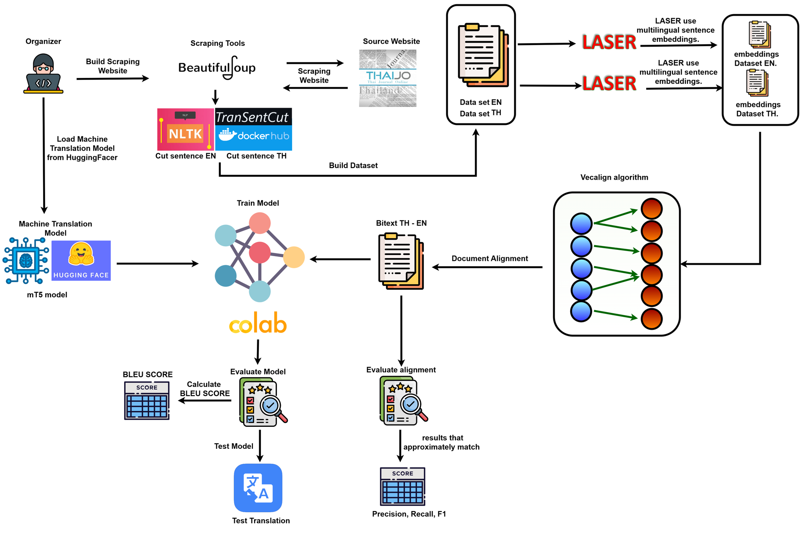
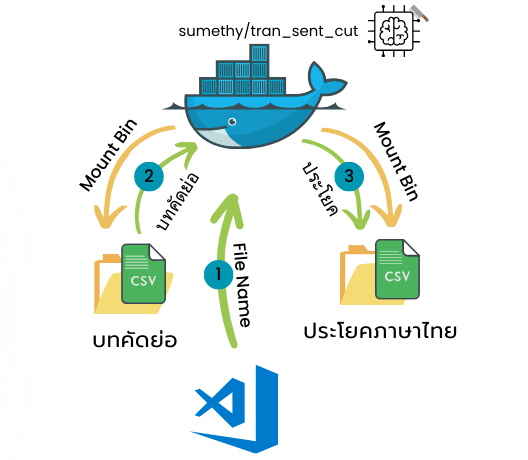

# อัลกอริทึมจับคู่ประโยคภาษาไทย-อังกฤษ สำหรับพัฒนาระบบแปลภาษาด้วยโครงข่ายประสาทเทียม
# Thai-English parallel sentence alignment algorithm for neural machine translation system development

Thai-English parallel sentence alignment algorithm for neural machine translation system development เป็นการศึกษาเกี่ยวกับการนำอัลกอริทึมการจับคู่ประโยคระหว่าง ภาษาอังกฤษ-ไทย เพื่อช่วยให้นักพัฒนาที่ต้องการพัฒนา Machine Tranlation สามารถที่จะจัดเตรียมชุดข้อมูลที่มีคุณภาพได้อย่างรวดเร็ว โดยทางคณะผู้จัดทำได้เลือกใช้ อัลกอริทึมการจะคู่ประโยคระหว่างสองภาษาที่มีการจับคู่ประโยคที่มีความถูกต้องและรวดเร็ว ชื่อว่า [Vecalign](https://github.com/thompsonb/vecalign/) ซึ่งใช้ความคล้ายคลึงกันของประโยคจากการ Embeding ด้วย Multilingual_Sentence_Embedding และการเขียนโปรแกรมการจับคู่ประโยคแบบ Dynamic โดยในโครงงานนี้คณะผู้จัดทำได้เลือกใช้ Multilingual_Sentence_Embedding ตามที่ผู้พัฒนาอัลกอริทึม Vecalign เลือกใช้ คือ [Language-Agnostic SEntence Representations (LASER)](https://github.com/facebookresearch/LASER)

### เมื่อ Embeding ประโยคในประโยคต่างภาษาที่มีความหมายเหมือนกัน ข้อมูล Vector จะใกล้เคียงกัน

[รูปจาก [Facebook AI post](https://engineering.fb.com/ai-research/laser-multilingual-sentence-embeddings/)]

### การทำงานของ Vecalign โดยใช้การเขียนโปรแกรมแบบ Dynamic

[รูปจาก [Vecalign GitHub](https://github.com/thompsonb/vecalign/?tab=readme-ov-file)]

ในการนำมาประยุกต์ใช้งานกับภาษาไทยนั้น สิ่งที่ท้าทายที่สุดสำหรับการจับคู่ประโยค ภาาษาไทย-อังกฤษ คือ การตัดประโยค เนื่องมาจากประโยคในภาษาไทยนั้นไม่มีจุดสัญลักษณ์แสดงจุดสิ้นสุดประโยคที่ชัดเจน แต่จะใช้การเว้นวรรคแทน ซึ่งการเว้นวรรคนั้นยังคงถูกใช้ในบริบทอื่นๆ ด้วย ซึ่งวิธีในการตัดประโยคภาษาไทยที่สามารถตัดประโยคภาษาไทยได้ดีที่สุด และเปิดเผยต่อสาธารณะ ที่คณะผู้จัดทำเลือกใช้ คือ [Transentcut](https://github.com/sumethy/TranSentCut/)

### เมื่อนำเครื่องมือทั้งหมดมารวมกันจึงสามารถนำมาเขียนเป็นแนวคิดในการจัดทำชุดข้อมูลได้ ดังนี้

ในการจัดทำชุดข้อมูลมีขั้นตอน ดังนี้
  1. ดึงบทคัดย่อจากเว็บไซต์ทางวิชาการ
  2. การตัดบทคัดย่อภาษาไทย และภาษาอังกฤษ
  3. จับคู่ประโยคภาษาอังกฤษ-ไทย ด้วย Vecalign
  4. การวัดผลลัพธ์ค่าความแม่นยำในการจับคู่ประโยคระหว่างเอกสารภาษาไทย และภาษาอังกฤษที่มาจาก Vecalign

## ขั้นตอนการจัดทำชุดข้อมูล
### 1. ดึงบทคัดย่อจากเว็บไซต์ทางวิชาการ
  ในการดึงบทคัดย่อมาจากเว็ยไซต์ ThaiJO จะดึงบทคัดย่อจากวารสาร วิศวกรรมศาสตร์ ที่ใช้ฟอร์มเว็บไซต์ของ [Thai Journal Online (ThaiJO)](https://www.tci-thaijo.org) ที่ผ่านการรับรอง Tier 1, Tier 2, และ Tier 3 โดยโปรแกรมของผู้จัดทำจะเข้าไปดึงข้อมูลจากหน้าเว็บไซต์ทั้งหมด 4 หน้าเว็บไซต์ เพื่อรวบรวมลิงค์ สำหรับดึงบทคัดย่อ ซึ่งมีลำดับดังนี้ 1) หน้าเว็บไซต์วารสารย้อนหลัง --> 2) หน้าเว็บไซต์วารสารย้อนหลังแต่ละฉบับ --> 3) หน้าเว็บไซต์ของบทคัดย่อภาษาแรก --> 4) หน้าเว็บไซต์ของบทคัดย่อภาษาที่สอง
  โดยสามารถรันโปรแกรมให้ทำงานดังนี้
  - ให้รวบรวมลิงค์ของวารสารที่ต้องการดึงลิงค์ ดยสามารถคัดเลือกจากการ Export ไฟล์ Excel จากฐานข้อมูล TCI ได้ และนำมาคัดเลือกเฉพาะลิงค์ที่เข้าเงื่อนไขที่ต้องการและจัดรูปแบบให้เข้ากับรูปแบบที่เรากำหนด ซึ่งประกอบด้วย Column 'Tier' และ Link ของ 'Journal' ดังตัวอย่างในไฟล์ journal/journal.csv
  - ให้รันโปรแกรม `Pull_article_link.py` เพื่อดึงลิงค์ของวารสารโดยที่จะต้องกำหนดพารามิเตอร์ล่วงหน้า คือ 1) Path ของ Folder ที่เก็บลิงค์ 2) Path ของ Folder ที่จะเก็บบทคัดย่อ 3) ปีเริ่มต้นที่จะดึงข้อมูล 4) ปีสุดท้ายที่จะดึงข้อมูล

เมื่อดึงข้อมูลแล้วโปรแกรมจะเก็บข้อมูลเป็นไฟล์ตามบทคัดย่อเก็บไฟล์ใน Folder ที่ระบุ โดยจะจัดเก็บชื่อเป็นตัวเลข

*หมายเหตุ โปรแกรมในการดึงข้อมูลจากเว็บไซต์ ThaiJO จะไม่สามารถใช้งานได้หากในอนาคตมีการเปลี่ยนรูปแบบของเว็บไซต์ (ณ วันที่ 17/10/2024)

### 2. การตัดบทคัดย่อภาษาไทย และภาษาอังกฤษ
#### การตัดประโยคบทคัดย่อภาษาไทย
ในการตัดประโยคบทคัดย่อภาษาอังกฤษจะใช้การตัดประโยคด้วย Transentcut โดยติดตั้งบน (Docker)[https://www.docker.com/] และใช้การดึงบทคัดย่อที่ต้องการตัด จากโฟลเดอร์ที่ Mount bin ไว้ และจะจัดเก็บข้อมูลหลังจากตัดประโยคเสร็จสิ้นด้วยการจัดเก็บไว้ในโฟลเดอร์ที่ Mount bin ไว้เช่นกัน



ขั้นตอนการเตรียมเครื่องมือสำหรับการตัดประโยคภาษาไทย
- ติดตั้ง Docker
- ดึง Image ชื่อว่า [sumethy/tran_sent_cut](https://hub.docker.com/r/sumethy/tran_sent_cut) (สามารถดึงโดยรันผ่าน CMD บน Window) ด้วยคำสั่ง
```
docker pull sumethy/tran_sent_cut:0.3gpu
```
- สร้าง Containner บน Docker
```
docker run -d --name some-name -v C:/Users/Sentence_Alignment/Prepare_data_set/thai_sentences:/app/thai_sentences -v C:/Users/Sentence_Alignment/Prepare_data_set/data:/app/data -e MAX_WORKERS="1" -e GPU_ENV="GPU" --gpus '"device=0"' sumethy/tran_sent_cut:0.3gpu
```
- นำไฟล์ที่เราได้แก้ไขขั้นการอ่านไฟล์และบันทึกไฟล์ โดยใช้คำสั่ง
```
cp /app/data/main.py /app/main.py
```
- ติดตั้ง Module ที่ใช้ในการบันทึกไฟล์ เนื่องจาก Image ของ Transentcut ไม่ได้ติดตั้งไว้
```
pip install pandas
```
- รันโปรแกรม `Cut_th.py` โดยมีพารามิเตอร์ต้องกำหนดคือ 1) Path ของ Folder ที่เก็บไฟล์ count.csv 2) Path ของ Folder ที่จัดเก็บบทคัดย่อ 3) Path ของ Folder ที่จัดเก็บบทคัดย่อบน Docker 4) Path ของ Folder ที่จะจัดเก็บประโยคที่ตัดบน Docker 5) ชื่อของ Containner บน Docker 6) โหมดในการตัดบทคัดย่อโดยมีสองโหมดคือ ตัดทั้งหมดใหม่ และตัดเฉพาะบทคัดย่อที่ยังไม่ได้ตัด

#### การตัดประโยคบทคัดย่อภาษาอังกฤษ
ในการตัดประโยคบทคัดย่อภาษาอังกฤษจะใช้การตัดประโยคด้วย [Natural Language Toolkit (NLTK)](https://www.nltk.org/) โดยตัดตามสัญลักษณ์สิ้นสุดประโยค
ซึ่งสามารถตัประโยคด้วยโปรแกรม `Cut_en.py` โดยพารามิเตอร์ที่กำหนดคือ 1) Path ของ Folder ที่เก็บไฟล์ count.csv 2) Path ของ Folder ที่จัดเก็บบทคัดย่อ 3) Path ของ Folder ที่จัดเก็บไฟล์เมื่อตัดบทคัดย่อเสร็จสิ้น ซึ่งเมื่อตัดประโยคเสร็จสิ้นจะจัดเก็บไว้เป็นลำดับตัวเลข

### 3. จับคู่ประโยคภาษาอังกฤษ-ไทย ด้วย Vecalign
#### การจัดเตรียมเอกสารในรูปแบบ Sourch และ Target
ในการเตรียมเอกสารเราจะรวบรวมประโยคที่ได้รับการตัดประโยคให้มารวมเป็นไฟล์เดียวกันในแต่ละภาษา จะกำหนดให้ภาษาอังกฤษเป็น Sourch และภาษาไทยเป็น Target สามารถใช้การรันโปรแกรม `Combined_file.py` ซึ่งจะต้องกำหนดพารามิเตอร์ 1) Path ของ Folder ที่จัดเก็บไฟล์ count.csv 2) Path จัดเก็บไฟล์ภาษาไทย 3) Path จัดเก็บไฟล์ภาษาอังกฤษ

#### การจัดเตรียม Environment สำหรับ Vecalign
ในการจับคู่ประโยคภาษาไทยอังกฤษด้วย Vecalign กลุ่มของพวกเราได้ติดตั้งระบบปฏิบัติการ Linux Ubuntu ใน Vmware บน Window เพื่อใช้ในการรัน Vecalign 

ขั้นตอนในการติดตั้ง Vecalign (สามารถติดตั้งได้ตามขั้นตอนของผู้พัฒนาอัลกอริทึม Vecalign --> https://github.com/thompsonb/vecalign)

ให้ติดตั้งเครื่องมือที่จำเป็นในการแก้ไขหรือรันโปรมแกรม เช่น Vscode และ Anaconda หรือ Miniconda บน Ubutu จากนั้นรันคำสั่งต่อไปนี้เพื่อสร้าง Environment สำหรับ Vecalign
```
# Use latest conda
conda update conda -y
# Create conda environment
conda create  --force -y --name vecalign python=3.7
# Activate new environment
source `conda info --base`/etc/profile.d/conda.sh # See: https://github.com/conda/conda/issues/7980
conda activate vecalign
# Install required packages
conda install -y -c anaconda cython
conda install -y -c anaconda numpy
pip install mcerp 
```

ขั้นตอนในการติดตั้ง LASER version2 (สามารถติดตั้ง LASER version 2 ได้ตามขั้นตอนของผู้พัฒนา --> )

https://github.com/facebookresearch/LASER/blob/main/laser_encoders/README.md
#### การใช้งาน Vecalign


### 4. ขั้นตอนในการวัดผล
การวัด Precison Reacall และ F1-score

การวัด Bleualign และ ผลลัพธ์


--> File my project: https://drive.google.com/drive/folders/1zwWtStqdU82P4i07khiqbcD3pEC0Xkpi?usp=sharing

--> Link my project Hugginhface: https://huggingface.co/TristanN01/VEC-MT5

```
ไฟล์ใน drive ประกอบไปด้วย
--> ไฟล์ colab ในการฝึกเเบบจำลองเเละการปรับพารามิเตอร์
--> model ก่อนเเละหลังเพิ่มชุดข้อมูลจาก vecalign
--> ไฟล์ตัวอย่างของ vecalign เเละ laser ที่ได้ทำการตืดตั้งเเละใช้งานจริง
```


Github Vecalign --> https://github.com/thompsonb/vecalign

Github Laser    --> https://github.com/facebookresearch/LASER


Vecalign is an accurate sentence alignment algorithm which is fast even for very long documents.
In conjunction with [LASER](https://github.com/facebookresearch/LASER), Vecalign 
works in about 100 languages (i.e. 100^2 language pairs), 
without the need for a machine translation system or lexicon. 

Vecalign uses similarity of multilingual sentence embeddings to judge the similarity of sentences.
 
Vecalign uses an approximation to Dynamic Programming based on 
[Fast Dynamic Time Warping](https://content.iospress.com/articles/intelligent-data-analysis/ida00303)
which is linear in time and space with respect to the number of sentences being aligned. 


### License 

Copyright 2019 Brian Thompson

Vecalign is released under the [Apache License, Version 2.0](LICENSE).
For convenience, the dev and test datasets from Bleualign are provided. Bleualign is Copyright 2010 Rico Sennrich and is released under the [GNU General Public License Version 2](bleualign_data/LICENSE)

### Build Vecalign

You will need python 3.6+ with numpy and cython. You can build an environment using conda as follows:

```
# Use latest conda
conda update conda -y
# Create conda environment
conda create  --force -y --name vecalign python=3.7
# Activate new environment
source `conda info --base`/etc/profile.d/conda.sh # See: https://github.com/conda/conda/issues/7980
conda activate vecalign
# Install required packages
conda install -y -c anaconda cython
conda install -y -c anaconda numpy
pip install mcerp 
```

Note that Vecalign contains cython code, but there is no need to build it manually as it is compiled automatically by [pyximport](https://github.com/cython/cython/tree/master/pyximport).

### Run Vecalign (using provided embeddings)
```
./vecalign.py --alignment_max_size 8 --src bleualign_data/dev.de --tgt bleualign_data/dev.fr \
   --src_embed bleualign_data/overlaps.de bleualign_data/overlaps.de.emb  \
   --tgt_embed bleualign_data/overlaps.fr bleualign_data/overlaps.fr.emb
```

Alignments are written to stdout:
```
[0]:[0]:0.156006
[1]:[1]:0.160997
[2]:[2]:0.217155
[3]:[3]:0.361439
[4]:[4]:0.346332
[5]:[5]:0.211873
[6]:[6, 7, 8]:0.507506
[7]:[9]:0.252747
[8, 9]:[10, 11, 12]:0.139594
[10, 11]:[13]:0.273751
[12]:[14]:0.165397
[13]:[15, 16, 17]:0.436312
[14]:[18, 19, 20, 21]:0.734142
[]:[22]:0.000000
[]:[23]:0.000000
[]:[24]:0.000000
[]:[25]:0.000000
[15]:[26, 27, 28]:0.840094
...
```

The first two entries are the source and target sentence indexes for each alignment, respectively. 
The third entry in each line is the sentence alignment cost computed by Vecalign. 
Note that this cost includes normalization but does *not* include the penalties terms for containing more than one sentence. 
Note that the alignment cost is set to zero for insertions/deletions. 
Also note that the results may vary slightly due to randomness in the normalization.

To score against a gold alignment, use the "-g" flag.
Flags "-s", "-t", and "-g" can accept multiple arguments. This is primarily useful for scoring, as the output alignments will all be concatenated together in stdout. For example, to align and score the bleualign test set: 
```
./vecalign.py --alignment_max_size 8 --src bleualign_data/test*.de --tgt bleualign_data/test*.fr \
   --gold bleualign_data/test*.defr  \
   --src_embed bleualign_data/overlaps.de bleualign_data/overlaps.de.emb  \
   --tgt_embed bleualign_data/overlaps.fr bleualign_data/overlaps.fr.emb > /dev/null
```
Which should give you results that approximately match the Vecalign paper:

```

 ---------------------------------
|             |  Strict |    Lax  |
| Precision   |   0.899 |   0.985 |
| Recall      |   0.904 |   0.987 |
| F1          |   0.902 |   0.986 |
 ---------------------------------
```

Note: Run `./vecalign.py -h` for full sentence alignment usage and options. 
For stand-alone scoring against a gold reference, see [score.py](score.py)

### Embed your own documents

The Vecalign repository contains overlap and embedding files for the Bluealign dev/test files. 
This section shows how those files were made, as an example for running on new data.

Vecalign requires not only embeddings of sentences in each document, 
but also embeddings of *concatenations* of consecutive sentences.
The embeddings of multiple, consecutive sentences are needed to consider 1-many, many-1, and many-many alignments.


To create a file containing all the sentence combinations in the dev and test files from Bleualign:
```
./overlap.py -i bleualign_data/dev.fr bleualign_data/test*.fr -o bleualign_data/overlaps.fr -n 10
./overlap.py -i bleualign_data/dev.de bleualign_data/test*.de -o bleualign_data/overlaps.de -n 10
```

Note: Run `./overlap.py -h` to see full set of embedding options. 

`bleualign_data/overlaps.fr` and `bleualign_data/overlaps.de` are text files containing one or more sentences per line. 

These files must then be embedded using a multilingual sentence embedder.

We recommend the [Language-Agnostic SEntence Representations (LASER)](https://github.com/facebookresearch/LASER) 
toolkit from Facebook, as it has strong performance and comes with a pretrained model which works well in about 100 languages. 
However, Vecalign should also work with other embedding methods as well. Embeddings should be provided as a binary file containing float32 values.

The following assumes LASER is installed and the LASER environmental variable has been set.

To embed the Bleualign files using LASER:
```
$LASER/tasks/embed/embed.sh bleualign_data/overlaps.fr bleualign_data/overlaps.fr.emb [fra]
$LASER/tasks/embed/embed.sh bleualign_data/overlaps.de bleualign_data/overlaps.de.emb [deu]
```

> Please always refer [here](https://github.com/facebookresearch/LASER/blob/main/tasks/embed/README.md) for the latest usage of this script. The usage may vary across the different versions of LASER.

Note that LASER will not overwrite an embedding file if it exsts, so you may need to run first `rm bleualign_data/overlaps.fr.emb bleualign_data/overlaps.de.emb`.

### Document Alignment

[We propose](https://aclanthology.org/2020.emnlp-main.483) using Vecalign to rescore document alignment candidates, 
in conjunction with candidate generation using a document embedding method that retains sentence order information.
Example code for our document embedding method is provided [here](standalone_document_embedding_demo.py).

### Publications

If you use Vecalign, please cite our [Vecalign paper](https://www.aclweb.org/anthology/D19-1136):

```
@inproceedings{thompson-koehn-2019-vecalign,
    title = "{V}ecalign: Improved Sentence Alignment in Linear Time and Space",
    author = "Thompson, Brian and Koehn, Philipp",
    booktitle = "Proceedings of the 2019 Conference on Empirical Methods in Natural Language Processing and the 9th International Joint Conference on Natural Language Processing (EMNLP-IJCNLP)",
    month = nov,
    year = "2019",
    address = "Hong Kong, China",
    publisher = "Association for Computational Linguistics",
    url = "https://www.aclweb.org/anthology/D19-1136",
    doi = "10.18653/v1/D19-1136",
    pages = "1342--1348",
}
```

If you use the provided document embedding code or use Vecalign for document alignment, please cite our [document alignment paper](https://aclanthology.org/2020.emnlp-main.483):

```
@inproceedings{thompson-koehn-2020-exploiting,
    title = "Exploiting Sentence Order in Document Alignment",
    author = "Thompson, Brian  and
      Koehn, Philipp",
    booktitle = "Proceedings of the 2020 Conference on Empirical Methods in Natural Language Processing (EMNLP)",
    month = nov,
    year = "2020",
    address = "Online",
    publisher = "Association for Computational Linguistics",
    url = "https://aclanthology.org/2020.emnlp-main.483",
    doi = "10.18653/v1/2020.emnlp-main.483",
    pages = "5997--6007",
}
```
